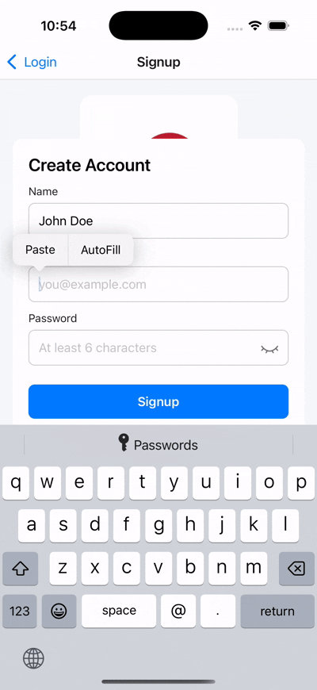
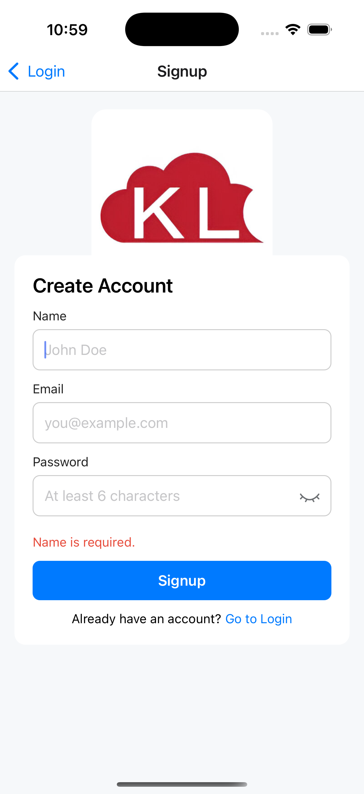
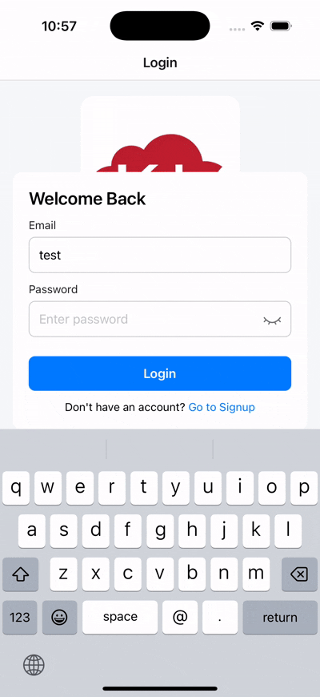
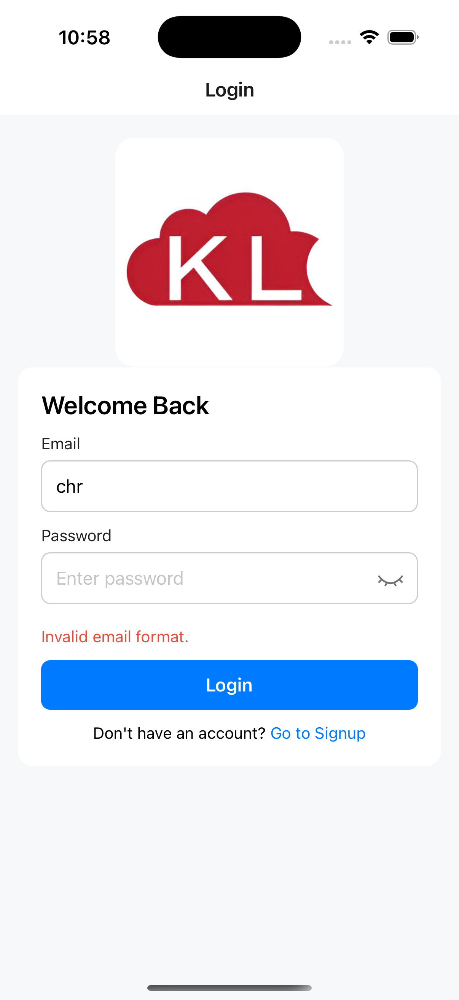
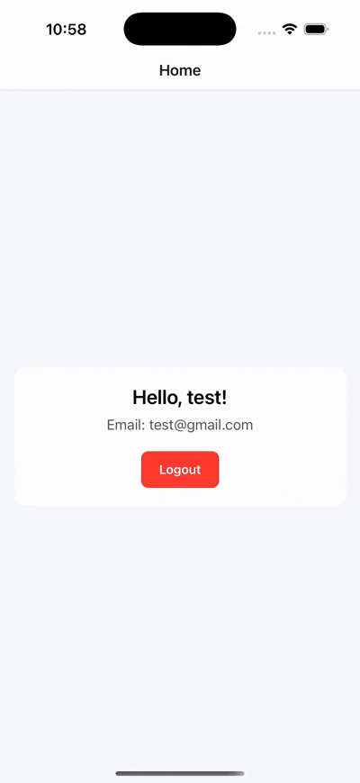

UserAuthenticator

A React Native (TypeScript) mobile app providing user signup, login, session persistence, and logout using Context API + AsyncStorage, as required in the assessment.

This app demonstrates:

Authentication using React Context

Signup & Login forms

Input validation (email & password)

Show/Hide password feature

Session persistence using AsyncStorage

Logout functionality

Navigation flows based on auth state

Clean folder structure & reusable components

🛠️ Tech Stack  
Library / Tool Purpose  
React Native 0.76.9 Framework  
node >=18  
React Navigation Screen navigation  
AsyncStorage Persisting auth data  
TypeScript Type safety  
Context API Global auth state  
ESLint + Prettier Code quality  
📂 Folder Structure  
src/  
├─ assets/ # Images etc./    
├─ context/ # AuthContext for login/signup/logout/state  
├─ screens/ # Login, Signup, Home  
├─ components/ # Input and UI helpers  
├─ navigation/ # Root navigation stack  
├─ api/ # Mock storage (if needed)  
└─ App.tsx  

🚀 Features  
Feature Description  
✅ Signup Screen Enter name, email, password  
✅ Login Screen Email + password authentication  
✅ Form Validation Email format & password rules  
✅ Password Toggle Show/Hide password field  
✅ Error Messages Incorrect credentials / Validation errors  
✅ AsyncStorage Persistence User remains logged in after app restart  
✅ Logout Clears session and redirects to Login  
✅ Clean UI Minimal, simple card-based layout  
✅ TypeScript Strong typing for navigation & context  
📦 Installation & Run  
1️⃣ Install dependencies  
npm install

or

yarn

2️⃣ Start Metro
npm start

3️⃣ Run on device / emulator

For Android:

npm run android

For iOS:

npm run ios / open ios/UserAuthenticator.xcworkspace via xcode to run on simulator

✅ How It Works

Authentication is handled via Context + AsyncStorage:

signup() stores new user credentials in AsyncStorage

login() verifies credentials and stores active session

logout() clears session storage

App auto-checks session on launch to show correct screen

Navigation automatically updates based on user state.

🔐 Security Note (for Reviewer)!

This demo intentionally uses AsyncStorage for mock auth storage as required in the assessment.

In production, credentials should be hashed securely & verified via backend API.

📸 Demo Flow

✅ Signup success → navigates to Home

  
  

✅ Login success → navigates to Home

  

❌ Login wrong credentials → error message

  

✅ Logout → returns to Login

  

✅ App restart → stays logged in (storage persistence)

  

👨‍💻 Developer Info

Project Name: UserAuthenticator  
Language: TypeScript  
React Native Version: 0.76.9  
Node Required: >= 18  

🏁 Conclusion

This project satisfies all assessment requirements:

✔ Signup  
✔ Login  
✔ Logout  
✔ Persistent Auth  
✔ Error handling & validations  
✔ Password visibility toggle  
✔ Clean architecture  
✔ TypeScript typing  
✔ No backend — mock persistence as required  
